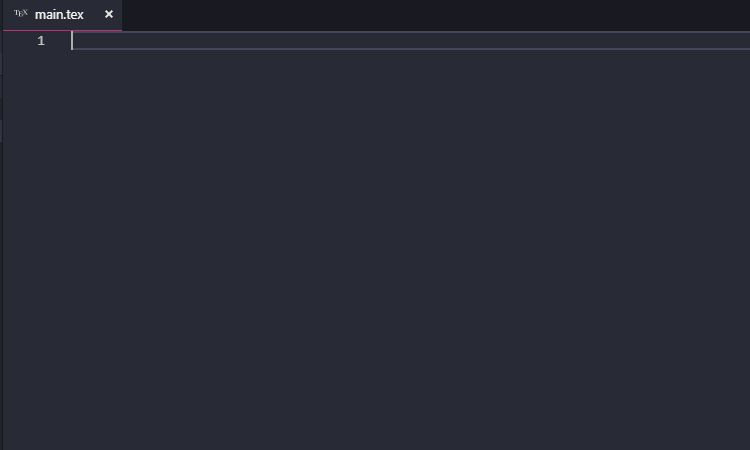

[](https://github.com/latex-lsp/texlab/actions)
[](https://github.com/latex-lsp/texlab/wiki)
[](https://github.com/latex-lsp/texlab/releases)
[](https://ctan.org/pkg/texlab)

# TexLab

A cross-platform implementation of the [Language Server Protocol](https://microsoft.github.io/language-server-protocol)
providing rich cross-editing support for the [LaTeX](https://www.latex-project.org/) typesetting system.
The server may be used with [any editor that implements the Language Server Protocol](https://microsoft.github.io/language-server-protocol/implementors/tools/).



## Getting Started

If your editor extension like does not install the TexLab server automatically,
you will need to install it manually.
We provide [precompiled binaries](https://github.com/latex-lsp/texlab/releases)
for Windows, Linux and macOS.
Alternatively, you can build TexLab from source or install it using your package manager.
For a list of supported package managers, you can take a look at [Repology](https://repology.org/project/texlab/versions):

[](https://repology.org/project/texlab/versions)

### Requirements

A [TeX distribution](https://www.latex-project.org/get/#tex-distributions) is _not_ strictly required
to use the server but TexLab cannot compile your documents without one.
TexLab supports compiling using [Tectonic](https://tectonic-typesetting.github.io/).
For an example configuration, please see [here](https://github.com/latex-lsp/texlab/wiki/Tectonic).

On Windows, you may need to install [Microsoft Visual C++ Redistributable for Visual Studio 2015](https://www.microsoft.com/en-US/download/details.aspx?id=48145).

### Building from Source

You will need to install the following dependencies to compile the server:

- A recent, stable version of [Rust](https://rustup.rs/)

Then run the following command in the project folder:

```shell
cargo build --release
```

Avoid installing `texlab` from [crates.io](https://crates.io/crates/texlab)
because we don't publish new versions of the server to the registry, anymore.
Instead, you can use

```shell
cargo install --git https://github.com/latex-lsp/texlab --locked --tag <insert version here>
```

## Usage

After installing an editor extension, you can simply start editing LaTeX files. All editing features work out-of-the-box over all files in the currently opened workspace.
There is no need for magic comments like `%!TEX root`
and TexLab should figure out the dependencies of a file on its own.
Note that you may need to set the `texlab.rootDirectory` option for some multi-folder projects.

TexLab features a variety of options which can be used to configure features like building or forward search.

See the [Wiki](https://github.com/latex-lsp/texlab/wiki) for more information.

## Development

You can create a debug build by building the server without the `--release` flag.
The resulting build can be used with the [Visual Studio Code extension](https://github.com/latex-lsp/texlab-vscode)
by adding the absolute path of the `target/debug` folder to your `PATH` environment variable.

TexLab has an extensive test suite of unit and integration tests. You can run them by executing

```shell
cargo test
```

in the project folder.

## Contributing

See [CONTRIBUTING.md](CONTRIBUTING.md) for details on our code of conduct, and the process for submitting pull requests to us.

## Maintainers

- Patrick Förster (patrick.foerster@outlook.de)

## License

[GPL-3.0](https://choosealicense.com/licenses/gpl-3.0/)
